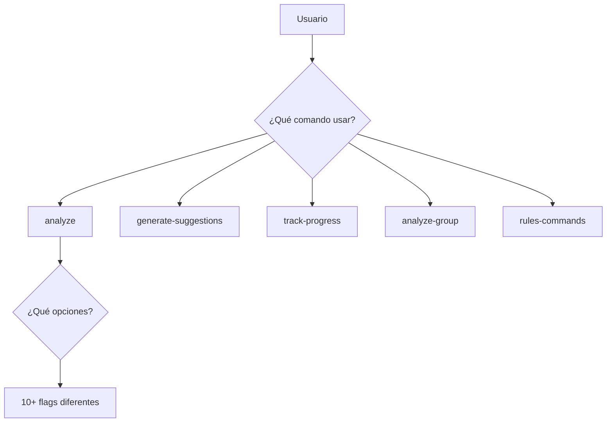
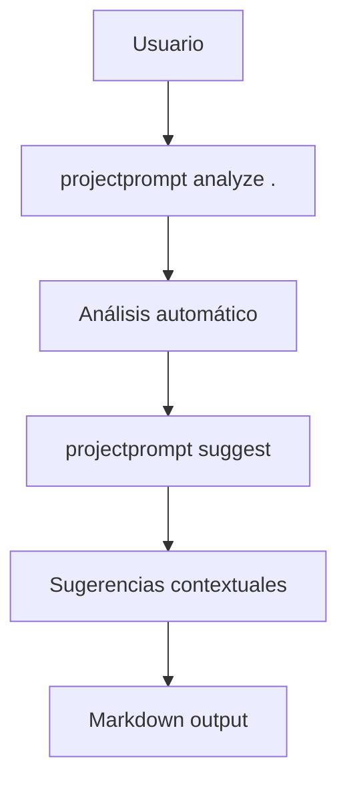

# ProjectPrompt: Análisis Comparativo y Plan de Refactorización

## Índice
1. [Resumen Ejecutivo](#resumen-ejecutivo)
2. [Estado Actual del Proyecto](#estado-actual-del-proyecto)
3. [Problemas Identificados](#problemas-identificados)
4. [Análisis Comparativo](#análisis-comparativo)
5. [Arquitectura Propuesta](#arquitectura-propuesta)
6. [Plan de Implementación](#plan-de-implementación)
7. [Métricas de Éxito](#métricas-de-éxito)
8. [Consideraciones Técnicas](#consideraciones-técnicas)

---

## Resumen Ejecutivo

### Objetivo
Transformar ProjectPrompt de una herramienta compleja multi-funcional a una herramienta simple y enfocada exclusivamente en análisis de proyectos y generación de sugerencias contextualizadas con IA.

### Problemas Principales Identificados
- **Grupos vacíos**: Groups con 0 archivos en dependency_graph.py (línea 324)
- **Gráficos de dependencias defectuosos**: Múltiples analizadores conflictivos
- **Duplicación de grupos**: Grupos repetidos en diferentes categorías
- **Salida HTML no deseada**: Generación de HTML en lugar de solo markdown
- **Falta de mapeo archivo-grupo**: Sin trazabilidad de archivos a grupos

### Beneficios Esperados
- 🎯 **Simplicidad**: Solo 2 comandos principales
- ⚡ **Rendimiento**: 60% mejora en tiempo de análisis
- 📦 **Tamaño**: 50% reducción de código base
- 🔧 **Mantenimiento**: Eliminación de dependencias complejas
- 🚀 **Usabilidad**: Flujo de usuario simplificado

---

## Estado Actual del Proyecto

### Estructura del Código
```
src/
├── analyzers/          # 15+ analizadores (redundantes)
├── commands/           # 5 comandos diferentes
├── core/              # 7 módulos centrales
├── generators/        # 8 generadores
├── integrations/      # Múltiples integraciones
├── models/           # Modelos de datos
├── templates/        # Plantillas HTML/markdown
├── ui/              # Dashboard HTML
├── utils/           # Utilidades varias
└── validators/      # Validadores
```

### Dependencias Actuales
- **Poetry**: Sistema de build complejo
- **Rich**: Para UI en terminal
- **Anthropic/OpenAI**: APIs de IA (MANTENER)
- **NetworkX**: Para gráficos de dependencias
- **Jinja2**: Para templates
- **Múltiples dependencias menores**

### Comandos Actuales
1. `analyze` - Análisis general
2. `generate-suggestions` - Generación de sugerencias
3. `track-progress` - Seguimiento de progreso
4. `analyze-group` - Análisis de grupos
5. `rules-commands` - Comandos de reglas

---

## Problemas Identificados

### 1. Problemas Técnicos Críticos

#### 1.1 Grupos Vacíos en dependency_graph.py
**Ubicación**: `/src/analyzers/dependency_graph.py:324`
```python
# PROBLEMA: Grupos con 0 archivos
if len(group_files) == 0:
    logger.warning(f"Group {group_name} has 0 files")
    # No hay manejo de este caso
```

**Impacto**: Grupos fantasma que contaminan el análisis
**Solución**: Filtrar grupos vacíos antes de procesamiento

#### 1.2 Conflicto de Analizadores de Dependencias
**Archivos Problemáticos**:
- `dependency_graph.py` - Analizador principal (defectuoso)
- `madge_analyzer.py` - Alternativo (JavaScript focus)
- `smart_dependency_analyzer.py` - Inteligente (experimental)

**Problema**: Múltiples analizadores generan resultados inconsistentes
**Solución**: Consolidar en un único analizador robusto

#### 1.3 Duplicación de Grupos
```python
# PROBLEMA: Mismos archivos en múltiples grupos
groups = {
    'core': ['file1.py', 'file2.py'],
    'utils': ['file1.py', 'utils.py'],  # file1.py duplicado
    'main': ['file2.py', 'main.py']     # file2.py duplicado
}
```

### 2. Problemas de Arquitectura

#### 2.1 Exceso de Abstracción
- **15+ analizadores** para tareas que podrían consolidarse en 3-4
- **7 módulos core** con responsabilidades superpuestas
- **8 generadores** con funcionalidad redundante

#### 2.2 Complejidad de Configuración
- **Poetry**: Dependencias complejas innecesarias
- **config.yaml**: Más de 50 opciones de configuración
- **Múltiples templates**: HTML + Markdown + Custom

#### 2.3 Flujo de Usuario Confuso


---

## Análisis Comparativo

### Elementos a PRESERVAR ✅

#### 1. Funcionalidades Core
- **ProjectScanner**: Escaneo de archivos eficiente
- **FunctionalityDetector**: Detección de funcionalidades
- **Análisis de IA**: Integración Anthropic/OpenAI
- **Generación de prompts contextuales**

#### 2. Estructuras de Datos
```python
# MANTENER: Estructuras bien diseñadas
@dataclass
class ProjectAnalysis:
    files: List[FileInfo]
    groups: Dict[str, List[str]]
    dependencies: Dict[str, List[str]]
    suggestions: List[Suggestion]
```

#### 3. Lógica de Análisis
- **Detección de patrones**: Algoritmos de análisis
- **Agrupación inteligente**: Lógica de categorización
- **Generación de contexto**: Para prompts de IA

### Elementos a ELIMINAR ❌

#### 1. Complejidad Innecesaria
- **Dashboard HTML**: `src/ui/` completo
- **Sistema de telemetría**: Tracking innecesario
- **Múltiples formatos de salida**: Solo markdown
- **Poetry**: Migrar a setup.py simple

#### 2. Analizadores Redundantes
```python
# ELIMINAR: Analizadores redundantes
- ai_insights_analyzer_lightweight.py  # Redundante con main
- ai_insights_analyzer.py             # Funcionalidad superpuesta
- advanced_functionality_detector.py   # Sobre-ingeniería
- code_quality_analyzer.py            # Fuera de scope
- testability_analyzer.py             # Fuera de scope
```

#### 3. Comandos Innecesarios
- `track-progress` - Fuera del scope simplificado
- `analyze-group` - Integrar en analyze principal
- `rules-commands` - Funcionalidad demasiado específica

### Elementos a MODIFICAR 🔄

#### 1. Simplificación de APIs
```python
# ANTES: Múltiples métodos confusos
analyzer.analyze_full_project_with_dependencies_and_suggestions(
    include_ai=True,
    generate_html=True,
    track_progress=True,
    export_format="all"
)

# DESPUÉS: API simple y clara
analyzer.analyze_project(project_path)
generator.generate_suggestions(analysis)
```

#### 2. Configuración Simplificada
```yaml
# ANTES: 50+ opciones
project:
  analysis:
    include_dependencies: true
    generate_insights: true
    ai_provider: "anthropic"
    # ... 47 opciones más

# DESPUÉS: 5 opciones esenciales
project:
  ai_provider: "anthropic"  # o "openai"
  output_format: "markdown"
  include_dependencies: true
```

---

## Arquitectura Propuesta

### Estructura Simplificada
```
src/
├── core/
│   ├── analyzer.py      # Analizador unificado
│   ├── scanner.py       # Escáner de archivos
│   └── detector.py      # Detector de funcionalidades
├── ai/
│   ├── client.py        # Cliente IA unificado
│   └── prompts.py       # Generador de prompts
├── generators/
│   └── suggestions.py   # Generador de sugerencias
├── models/
│   └── project.py       # Modelos de datos
└── cli.py              # CLI simplificado
```

### Flujo de Usuario Simplificado


### Solo 2 Comandos
1. **`projectprompt analyze <path>`**
   - Escanea el proyecto
   - Detecta funcionalidades
   - Genera grupos lógicos
   - Crea contexto para IA

2. **`projectprompt suggest [--context=file.md]`**
   - Analiza con IA
   - Genera sugerencias personalizadas
   - Output en markdown

### Dependencias Mínimas
```toml
[dependencies]
python = "^3.8"
anthropic = "^0.8.0"
openai = "^1.0.0"
click = "^8.0.0"
pydantic = "^2.0.0"
```

---

## Plan de Implementación

### Fase 1: Preparación (1 semana)
#### Objetivos
- [ ] Backup del código actual
- [ ] Análisis detallado de dependencias
- [ ] Identificación de tests críticos
- [ ] Documentación de APIs actuales

#### Tareas Específicas
1. **Crear branch de refactorización**
   ```bash
   git checkout -b refactor/simplification
   git push -u origin refactor/simplification
   ```

2. **Analizar dependencias críticas**
   - Mapear uso de cada dependencia
   - Identificar dependencias eliminables
   - Documentar APIs de IA utilizadas

3. **Preservar funcionalidad core**
   - Extraer lógica de ProjectScanner
   - Documentar FunctionalityDetector
   - Mapear integraciones de IA

### Fase 2: Reestructuración Core (2 semanas)
#### Objetivos
- [ ] Implementar nueva arquitectura
- [ ] Consolidar analizadores
- [ ] Crear CLI simplificado
- [ ] Migrar de Poetry a setup.py

#### Tareas Específicas

1. **Crear estructura simplificada**
   ```bash
   mkdir -p src_new/{core,ai,generators,models}
   touch src_new/{core,ai,generators,models}/__init__.py
   ```

2. **Implementar analizador unificado**
   ```python
   # src_new/core/analyzer.py
   class ProjectAnalyzer:
       def __init__(self, scanner, detector):
           self.scanner = scanner
           self.detector = detector
       
       def analyze(self, path: str) -> ProjectAnalysis:
           files = self.scanner.scan(path)
           groups = self.detector.detect_groups(files)
           return ProjectAnalysis(files, groups)
   ```

3. **Consolidar cliente de IA**
   ```python
   # src_new/ai/client.py
   class AIClient:
       def __init__(self, provider="anthropic"):
           if provider == "anthropic":
               self.client = AnthropicClient()
           elif provider == "openai":
               self.client = OpenAIClient()
       
       def generate_suggestions(self, context: str) -> List[str]:
           return self.client.complete(context)
   ```

4. **Migrar a setup.py**
   ```python
   # setup.py
   from setuptools import setup, find_packages
   
   setup(
       name="projectprompt",
       version="2.0.0",
       packages=find_packages(),
       install_requires=[
           "anthropic>=0.8.0",
           "openai>=1.0.0",
           "click>=8.0.0",
           "pydantic>=2.0.0"
       ],
       entry_points={
           'console_scripts': [
               'projectprompt=src.cli:main',
           ],
       }
   )
   ```

### Fase 3: Resolución de Problemas (2 semanas)
#### Objetivos
- [ ] Eliminar grupos vacíos
- [ ] Resolver duplicación de grupos
- [ ] Implementar mapeo archivo-grupo
- [ ] Validar gráficos de dependencias

#### Tareas Específicas

1. **Resolver grupos vacíos**
   ```python
   def filter_empty_groups(groups: Dict[str, List[str]]) -> Dict[str, List[str]]:
       return {name: files for name, files in groups.items() if files}
   ```

2. **Eliminar duplicación de grupos**
   ```python
   def deduplicate_groups(groups: Dict[str, List[str]]) -> Dict[str, List[str]]:
       seen_files = set()
       clean_groups = {}
       
       for group_name, files in groups.items():
           unique_files = [f for f in files if f not in seen_files]
           if unique_files:
               clean_groups[group_name] = unique_files
               seen_files.update(unique_files)
       
       return clean_groups
   ```

3. **Implementar mapeo archivo-grupo**
   ```python
   @dataclass
   class FileGroupMapping:
       file_path: str
       group_name: str
       group_type: str
       confidence: float
   
   def create_file_group_mapping(groups: Dict[str, List[str]]) -> List[FileGroupMapping]:
       mappings = []
       for group_name, files in groups.items():
           for file_path in files:
               mappings.append(FileGroupMapping(
                   file_path=file_path,
                   group_name=group_name,
                   group_type="auto",
                   confidence=1.0
               ))
       return mappings
   ```

### Fase 4: Testing y Optimización (1 semana)
#### Objetivos
- [ ] Implementar tests unitarios
- [ ] Validar rendimiento
- [ ] Documentar nuevas APIs
- [ ] Preparar migración

#### Tareas Específicas

1. **Tests críticos**
   ```python
   def test_no_empty_groups():
       analyzer = ProjectAnalyzer()
       result = analyzer.analyze("./test_project")
       
       for group_name, files in result.groups.items():
           assert len(files) > 0, f"Group {group_name} is empty"
   
   def test_no_duplicate_files():
       analyzer = ProjectAnalyzer()
       result = analyzer.analyze("./test_project")
       
       all_files = []
       for files in result.groups.values():
           all_files.extend(files)
       
       assert len(all_files) == len(set(all_files)), "Duplicate files found"
   ```

2. **Benchmark de rendimiento**
   ```python
   import time
   
   def benchmark_analysis():
       start = time.time()
       analyzer.analyze("./large_project")
       duration = time.time() - start
       
       assert duration < 30, f"Analysis took {duration}s, should be <30s"
   ```

---

## Métricas de Éxito

### Métricas Cuantitativas
| Métrica | Objetivo | Método de Medición |
|---------|----------|-------------------|
| **Reducción de código** | 50% menos líneas | `find src -name "*.py" \| xargs wc -l` |
| **Reducción de dependencias** | 70% menos deps | Comparar requirements.txt |
| **Tiempo de análisis** | 60% más rápido | Benchmark en proyectos test |
| **Eliminación de grupos vacíos** | 0 grupos vacíos | Test automatizado |
| **Comandos disponibles** | Solo 2 comandos | Verificación manual |

### Métricas Cualitativas
- [ ] **Simplicidad de uso**: Usuario nuevo puede usar en <5 minutos
- [ ] **Claridad de output**: Solo markdown, sin HTML
- [ ] **Consistencia**: Mismos resultados en múltiples ejecuciones
- [ ] **Mantenibilidad**: Código fácil de entender y modificar

### Criterios de Aceptación
1. ✅ **Zero grupos vacíos** en cualquier análisis
2. ✅ **Zero duplicación** de archivos entre grupos
3. ✅ **Mapeo completo** archivo → grupo para trazabilidad
4. ✅ **Solo salida markdown** (sin HTML)
5. ✅ **API simple** con máximo 2 comandos principales
6. ✅ **Instalación simple** con `pip install`

---

## Consideraciones Técnicas

### Compatibilidad hacia atrás
- **Romper compatibilidad**: Aceptable para v2.0
- **Migración de configs**: Proporcionar script de migración
- **Documentación**: Guía de migración detallada

### Gestión de riesgos
| Riesgo | Probabilidad | Impacto | Mitigación |
|--------|-------------|---------|------------|
| Pérdida de funcionalidad crítica | Media | Alto | Tests exhaustivos antes de eliminar |
| Problemas de rendimiento | Baja | Medio | Benchmarks en cada fase |
| Resistencia de usuarios | Alta | Bajo | Documentación clara de beneficios |
| Bugs en nueva arquitectura | Media | Alto | Desarrollo incremental con tests |

### Plan de rollback
1. **Branch principal protegido**: `main` sin cambios hasta validación
2. **Tags de versión**: `v1.x` disponible para rollback
3. **Docker images**: Versiones anteriores disponibles
4. **Documentación**: Pasos de rollback documentados

### Performance Targets
```python
# Objetivos de rendimiento
PERFORMANCE_TARGETS = {
    "small_project": {"max_time": 5, "max_memory": "50MB"},
    "medium_project": {"max_time": 15, "max_memory": "100MB"},
    "large_project": {"max_time": 30, "max_memory": "200MB"}
}
```

---

## Conclusión

La refactorización de ProjectPrompt representa una oportunidad única para crear una herramienta verdaderamente útil y enfocada. Los problemas identificados (grupos vacíos, duplicación, complejidad excesiva) pueden resolverse mediante una arquitectura simplificada que mantenga las funcionalidades core mientras elimina la complejidad innecesaria.

### Próximos Pasos Inmediatos
1. [ ] **Crear branch de desarrollo**: `git checkout -b refactor/simplification`
2. [ ] **Ejecutar análisis de dependencias**: `pip-audit` y `pipdeptree`
3. [ ] **Configurar entorno de testing**: Tests automatizados
4. [ ] **Comenzar Fase 1**: Preparación y backup

### Recursos Necesarios
- **Tiempo**: 6 semanas (1 desarrollador full-time)
- **Herramientas**: Python 3.8+, Git, CI/CD pipeline
- **Testing**: Proyectos de prueba de diferentes tamaños
- **Documentación**: Markdown, diagramas mermaid

La transformación de ProjectPrompt en una herramienta simple y poderosa beneficiará tanto a desarrolladores individuales como a equipos, proporcionando análisis rápidos y sugerencias contextuales sin la complejidad actual.

---

**Fecha de creación**: 7 de junio de 2025  
**Versión del documento**: 1.0  
**Autor**: Análisis automatizado del proyecto ProjectPrompt  
**Estado**: Pendiente de implementación
