# ProjectPrompt Command Mind Map

This mermaid mind map shows the complete command structure and hierarchy of ProjectPrompt v1.2.7.

## 🗺️ Complete Command Overview



```mermaid
mindmap
  root((ProjectPrompt))
    Core Commands
      analyze
        ::icon(ğŸ”)
        Basic project analysis
        --max-files
        --max-size
        --functionalities
        --structure
        --output
      dashboard
        ::icon(📊)
        Generate visual dashboard
        --format html/markdown
        --output
        --interactive
      version
        ::icon(ℹï¸)
        Show version info
        API status check
      help
        ::icon(â“)
        Detailed help system
        Command reference
      init
        ::icon(🚀)
        Initialize new project
        --path
        Project structure setup
      menu
        ::icon(ğŸ›ï¸)
        Interactive interface
        GUI navigation
        
    API Configuration
      set-api
        ::icon(🔑)
        Configure AI services
        anthropic
        openai
        github
      verify-api
        ::icon(✅)
        Check API status
        Connection test
      check-env
        ::icon(ğŸŒ)
        Environment validation
        Variable check
        
    Project Analysis
      analyze-group
        ::icon(📂)
        Functional group analysis
        Group selection
        Progress tracking
      generate-suggestions
        ::icon(💡)
        AI improvement suggestions
        Architecture recommendations
        Best practices
      track-progress
        ::icon(📈)
        Development progress
        Phase tracking
        Completion metrics
        
    AI Features
      ai analyze
        ::icon(🤖)
        AI-powered code analysis
        --detail advanced/basic
        --output json/markdown
      ai refactor
        ::icon(🔧)
        Refactoring suggestions
        Code improvements
        Pattern detection
      ai explain
        ::icon(ğŸ“)
        Code explanation
        Function analysis
        Architecture insights
      ai generate
        ::icon(✨)
        Code generation
        Documentation creation
        Template generation
        
    Rules Management
      rules suggest
        ::icon(📋)
        AI rule suggestions
        --ai flag
        --threshold
        --confidence
      rules analyze-patterns
        ::icon(ğŸ”)
        Pattern analysis
        --detailed
        Project insights
      rules generate-project-rules
        ::icon(📄)
        Clean rules format
        --ai enhancement
        --output markdown
      rules auto-generate
        ::icon(âš¡)
        Complete auto-generation
        --output yaml/json
      rules generate-structured-rules
        ::icon(ğŸ—ï¸)
        Sophisticated rules
        Enterprise-grade
        YAML export
      rules validate-structured-rules
        ::icon(✔ï¸)
        Rule validation
        Syntax checking
        Compliance verification
      rules wizard
        ::icon(🧙)
        Interactive setup
        Guided configuration
        Template selection
      rules init
        ::icon(🔰)
        Initialize rules file
        Basic setup
      rules validate
        ::icon(ğŸ”)
        Syntax validation
        Rule checking
      rules apply
        ::icon(âš™ï¸)
        Apply and verify
        Compliance check
      rules report
        ::icon(📊)
        Compliance reports
        Violation tracking
        
    Premium Features
      premium dashboard
        ::icon(ğŸ’)
        Advanced dashboard
        Interactive visualization
        Real-time metrics
      premium implementation
        ::icon(🛠ï¸)
        Implementation assistant
        Feature guidance
        Code scaffolding
      premium test-generator
        ::icon(🧪)
        Unit test generation
        Coverage analysis
      premium verify-completeness
        ::icon(📋)
        Completeness verification
        Quality assurance
        
    Documentation
      docs list
        ::icon(📚)
        Available documents
        Navigation tree
      docs view
        ::icon(ğŸ‘ï¸)
        Document viewer
        Markdown rendering
      docs generate
        ::icon(ğŸ“)
        Auto-documentation
        Project docs
      docs navigate
        ::icon(🧭)
        Interactive navigation
        Document browser
        
    Utilities
      delete
        ::icon(🗑ï¸)
        Cleanup generated files
        --force flag
        Selective removal
      setup-alias
        ::icon(🔗)
        Command shortcuts
        Shell integration
      setup-deps
        ::icon(📦)
        Optional dependencies
        Feature enablement
      set-log-level
        ::icon(📊)
        Logging control
        debug/info/warning
      diagnose
        ::icon(🔧)
        Issue diagnosis
        Installation check
        Troubleshooting
        
    Subscription
      subscription plans
        ::icon(💳)
        Available plans
        Feature comparison
      subscription activate
        ::icon(🔓)
        License activation
        Premium unlock
      subscription info
        ::icon(ℹï¸)
        Current status
        Plan details
        
    Telemetry
      telemetry enable
        ::icon(📊)
        Usage analytics
        Anonymous data
      telemetry disable
        ::icon(🚫)
        Opt-out analytics
        Privacy mode
      telemetry status
        ::icon(📈)
        Current settings
        Data collection info
        
    Update System
      update check
        ::icon(🔄)
        Version checking
        Update availability
      update install
        ::icon(⬇ï¸)
        Auto-update
        Version upgrade
      update sync
        ::icon(🔄)
        Synchronization
        Remote updates
```

## 📖 Command Categories Explained

### 🔧 Core Commands
Essential commands for basic ProjectPrompt functionality:
- **analyze**: Main project analysis engine
- **dashboard**: Visual project overview generation
- **version**: System information and status
- **help**: Comprehensive help system
- **init**: Project initialization
- **menu**: Interactive GUI interface

### 🔑 API Configuration
Commands for setting up AI integrations:
- **set-api**: Configure API keys for AI services
- **verify-api**: Test API connections
- **check-env**: Validate environment setup

### 📊 Project Analysis
Advanced project examination tools:
- **analyze-group**: Analyze specific functional groups
- **generate-suggestions**: AI-powered improvement recommendations
- **track-progress**: Development progress monitoring

### 🤖 AI Features
AI-powered analysis and generation:
- **ai analyze**: Deep code analysis with AI
- **ai refactor**: Intelligent refactoring suggestions
- **ai explain**: Code explanation and documentation
- **ai generate**: Content and code generation

### 📋 Rules Management
Comprehensive rule system for project governance:
- **rules suggest**: AI-generated development rules
- **rules wizard**: Interactive rule configuration
- **rules validate**: Rule syntax and compliance checking
- **rules generate-structured-rules**: Enterprise-grade rule generation

### 💎 Premium Features
Advanced functionality requiring subscription:
- **premium dashboard**: Enhanced interactive dashboards
- **premium implementation**: Implementation assistance
- **premium test-generator**: Automated test creation

### 📚 Documentation
Documentation management and navigation:
- **docs list**: Browse available documentation
- **docs view**: Interactive document viewer
- **docs generate**: Auto-generate project documentation

### 🛠️ Utilities
System maintenance and configuration:
- **delete**: Clean up generated files
- **diagnose**: Troubleshoot installation issues
- **setup-deps**: Install optional dependencies

### 💳 Subscription & Telemetry
Account and analytics management:
- **subscription**: Premium license management
- **telemetry**: Usage analytics control

## 🎯 Command Usage Patterns

### Quick Start Commands
```bash
project-prompt analyze          # Basic analysis
project-prompt dashboard        # Generate overview
project-prompt help            # Get help
```

### AI-Powered Workflow
```bash
project-prompt set-api anthropic YOUR_KEY
project-prompt ai analyze src/
project-prompt rules suggest --ai
project-prompt generate-suggestions
```

### Rules Management Workflow
```bash
project-prompt rules wizard     # Interactive setup
project-prompt rules validate   # Check rules
project-prompt rules apply      # Enforce rules
project-prompt rules report     # Generate compliance report
```

### Premium Features
```bash
project-prompt subscription activate LICENSE_KEY
project-prompt premium dashboard
project-prompt premium implementation "user authentication"
```

---

*This mind map represents the complete command structure of ProjectPrompt v1.2.7 - your comprehensive project analysis and AI-powered development assistant.*
