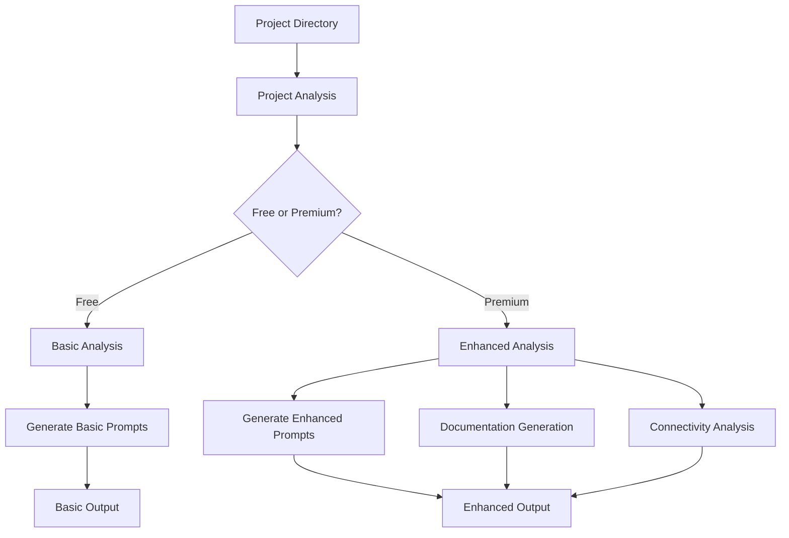
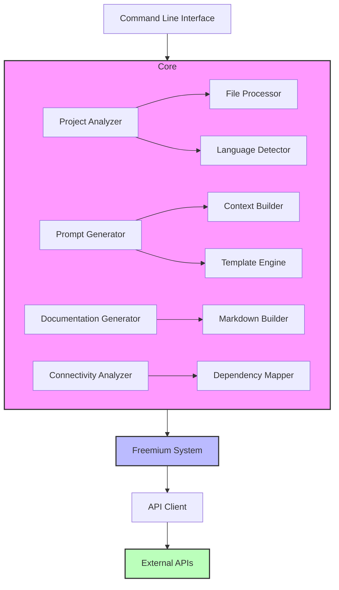

# ProjectPrompt Documentation

> **Language Options**: [English (current)](complete_documentation.md) | [Español](documentacion_completa_es.md)

## Overview

ProjectPrompt is an intelligent assistant for analyzing projects and generating contextual prompts for AI models. It helps developers understand project structure, detect functionalities, and create optimized prompts for various AI assistants.

### Workflow Diagram



The workflow diagram shows how ProjectPrompt processes a project directory through analysis and generates different outputs depending on whether free or premium features are being used.

## Table of Contents

1. [Installation](#installation)
2. [Core Functions](#core-functions)
   - [Project Analysis](#project-analysis)
   - [Project Initialization](#project-initialization)
   - [Documentation Generation](#documentation-generation)
   - [Connectivity Analysis](#connectivity-analysis)
   - [Prompt Generation](#prompt-generation)
3. [Advanced Features](#advanced-features)
   - [Enhanced Prompts](#enhanced-prompts)
   - [Freemium System](#freemium-system)
4. [Command Reference](#command-reference)
5. [Scripts Reference](#scripts-reference)
6. [Testing](#testing)
7. [Development](#development)

## Installation

### Quick Installation from Repository

```bash
# Download the repository
git clone https://github.com/projectprompt/project-prompt.git
cd project-prompt

# Create symbolic links to scripts
mkdir -p $HOME/bin
ln -sf $(pwd)/project_prompt.py $HOME/bin/project-prompt
chmod +x $HOME/bin/project-prompt

# Ensure $HOME/bin is in PATH
echo 'export PATH="$HOME/bin:$PATH"' >> ~/.bashrc  # or ~/.zshrc for zsh
source ~/.bashrc  # or source ~/.zshrc
```

### Package Installation (Coming Soon)

```bash
# With pip
pip install project-prompt

# With Poetry
poetry add project-prompt
```

## Core Functions

### Project Analysis

The project analysis function examines a project's structure, identifies languages, and detects key functionalities.

#### Project Type Examples

ProjectPrompt works with various types of projects. Here are examples for different project types:

##### Web Application Project

```bash
# Analyzing a React web application
project-prompt analyze /path/to/react-app

# Expected output highlights:
# - JavaScript/TypeScript detection
# - React component structure identification
# - Package.json dependencies analysis
# - Front-end architecture detection
# - API integration points
```

##### Python Package Project

```bash
# Analyzing a Python package
project-prompt analyze /path/to/python-package

# Expected output highlights:
# - Python module structure
# - Import relationships
# - Package dependencies from requirements.txt
# - Test coverage information
```

##### Microservices Project

```bash
# Analyzing a microservices architecture
project-prompt analyze /path/to/microservices-project

# Expected output highlights:
# - Service identification
# - Inter-service communication patterns
# - Deployment configuration detection
# - API endpoints mapping
```

#### Commands

```bash
# Basic analysis
project-prompt analyze

# Analyze specific project
project-prompt analyze /path/to/project

# Save analysis to JSON
project-prompt analyze /path/to/project --output analysis.json

# Show project structure
project-prompt analyze /path/to/project --structure
```

#### Standalone Scripts

- `quick_analyze.py` - Simple analysis without dependencies
- `project_analyzer.py` - Detailed analysis with JSON output
- `simple_analyze.py` - Minimal analysis with stats

#### Analysis Features

- Directory structure mapping
- Language detection and statistics
- Important file identification
- Dependency detection
- Size and complexity metrics

#### Example

```bash
$ project-prompt analyze .

Analyzing project at: .
...
Project Statistics:
Total files: 42
Total directories: 15
Analyzed files: 38
Binary files: 4
Total size: 256 KB

Language Distribution:
- Python: 28 files, 3456 lines
- Markdown: 8 files, 512 lines
- JSON: 3 files, 128 lines
...
```

### Project Initialization

The project initialization function creates a new project with a standardized structure.

#### Commands

```bash
# Create new project
project-prompt init my-project

# Create project in specific path
project-prompt init my-project --path /destination/path
```

#### Standalone Script

- `quick_init.py` - Project creation utility

#### Features

- Creates standard directory structure (src, tests, docs)
- Adds essential files (README.md, setup.py)
- Configures Git with .gitignore
- Sets up basic project metadata
- Creates initial module structure

#### Example

```bash
$ project-prompt init weather-app

Creating project structure for 'weather-app'...
Created directory: src/
Created directory: tests/
Created directory: docs/
Created file: README.md
Created file: setup.py
Created file: .gitignore
Created file: src/__init__.py
Created file: src/main.py
...

Project successfully created!
```

### Documentation Generation

The documentation generation function creates comprehensive documentation based on project analysis.

#### Commands

```bash
# Generate docs for current project
project-prompt docs

# Generate docs for specific project
project-prompt docs /path/to/project

# Generate docs with specific format
project-prompt docs /path/to/project --format markdown

# Save docs to specific file
project-prompt docs /path/to/project --output project_docs.md
```

#### Features

- Extracts documentation from docstrings
- Creates function and class references
- Generates project structure overview
- Identifies and documents APIs
- Creates usage examples

### Connectivity Analysis

The connectivity analysis function maps dependencies and relationships between project components.

#### Commands

```bash
# Analyze connections in current project
project-prompt connections

# Analyze connections in specific project
project-prompt connections /path/to/project

# Save connections analysis to JSON
project-prompt connections /path/to/project --output connections.json
```

#### Features

- Maps import relationships
- Identifies function calls between modules
- Detects circular dependencies
- Visualizes module relationships
- Identifies core components

### Prompt Generation

The prompt generation function creates AI-optimized prompts with project context.

#### Commands

```bash
# Generate prompts for current project
project-prompt generate-prompts

# Generate prompts for specific project
project-prompt generate-prompts /path/to/project

# Generate enhanced prompts
project-prompt generate-prompts /path/to/project --enhanced

# Save prompts to file
project-prompt generate-prompts /path/to/project --output prompts.json
```

#### Features

- Creates contextual prompts with project information
- Incorporates relevant code snippets
- Adds architectural context
- Optimizes for different AI models
- Includes specific functionalities

## Advanced Features

### Enhanced Prompts

The enhanced prompts feature provides more sophisticated prompt generation with deeper project analysis.

#### Commands

```bash
# Generate enhanced prompts
project-prompt generate-prompts --enhanced

# Generate premium prompts (requires API key)
project-prompt generate-prompts --premium
```

#### Features

- Deep semantic analysis of code
- Automatic identification of patterns and architectures
- Integration of best practices and suggestions
- Guided questions for clarification
- Advanced dependency analysis

### Freemium System

ProjectPrompt uses a freemium model with basic features available for free and advanced features requiring an API key.

#### Free Features

- Basic project analysis
- Project initialization
- Simple prompt generation
- Project structure visualization

#### Premium Features (Requires API Key)

- Enhanced prompt generation
- Detailed documentation generation
- Connectivity analysis
- Implementation suggestions
- Architecture recommendations

#### Setting API Keys

```bash
# Set Anthropic API key
project-prompt set-api anthropic YOUR_API_KEY

# Set GitHub API key
project-prompt set-api github YOUR_API_KEY
```

## Command Reference

### Main Command: `project_prompt.py`

Central entry point that provides access to all features.

```
Usage: project-prompt [COMMAND] [OPTIONS]

Commands:
  analyze              Analyze project structure and functionalities
  init                 Initialize a new project
  docs                 Generate project documentation
  connections          Analyze project connectivity
  generate-prompts     Generate contextual prompts
  set-api              Configure API keys
  menu                 Start interactive menu
  config               Manage configuration
```

### Analyze Command

```
Usage: project-prompt analyze [PATH] [OPTIONS]

Arguments:
  PATH                 Project path to analyze [default: .]

Options:
  --output, -o TEXT    Save analysis to JSON file
  --max-files, -m INT  Maximum files to analyze [default: 10000]
  --max-size, -s FLOAT Size limit for files in MB [default: 5.0]
  --functionalities/--no-functionalities  Detect functionalities [default: true]
  --structure/--no-structure  Show project structure [default: false]
```

### Init Command

```
Usage: project-prompt init NAME [OPTIONS]

Arguments:
  NAME                 Name of the new project

Options:
  --path, -p TEXT      Path where to create project [default: .]
```

### Docs Command

```
Usage: project-prompt docs [PATH] [OPTIONS]

Arguments:
  PATH                 Project path [default: .]

Options:
  --output, -o TEXT    Output file path
  --format, -f TEXT    Format: md, html, json [default: md]
```

### Connections Command

```
Usage: project-prompt connections [PATH] [OPTIONS]

Arguments:
  PATH                 Project path [default: .]

Options:
  --output, -o TEXT    Output file path
  --format, -f TEXT    Format: json, dot, graphml [default: json]
```

### Generate-Prompts Command

```
Usage: project-prompt generate-prompts [PATH] [OPTIONS]

Arguments:
  PATH                 Project path [default: .]

Options:
  --output, -o TEXT    Output file path
  --premium, -p        Use premium features [default: false]
  --enhanced, -e       Use enhanced generator [default: false]
  --store/--no-store   Save to project structure [default: true]
```

## Scripts Reference

### Main Scripts

- `project_prompt.py` - Main entry point
- `quick_analyze.py` - Standalone project analyzer
- `quick_init.py` - Project initialization
- `project_analyzer.py` - Detailed project analysis

### Utility Scripts

- `simple_analyze.py` - Simplified analysis script
- `verify_freemium_system.py` - Tests freemium restrictions
- `set_anthropic_key.py` - Sets up API keys

### Testing Scripts

- `test_projectprompt.sh` - Basic test script
- `enhanced_test_projectprompt.sh` - Comprehensive testing
- `run_complete_test.sh` - Full test suite with report
- `cleanup_project.sh` - Removes unnecessary files

## Testing

ProjectPrompt includes a comprehensive testing framework for verifying all functionality.

### Running Tests

```bash
# Run basic tests
./test_projectprompt.sh

# Run enhanced tests
./enhanced_test_projectprompt.sh

# Run complete test suite with report
./run_complete_test.sh
```

### Test Cases

The testing system covers:

1. Basic project analysis
2. Project structure analysis with JSON output
3. Project initialization
4. Functionality comparison
5. Standalone analyzer testing
6. Project subpart analysis
7. Output format testing
8. Documentation generation
9. Connectivity analysis
10. Freemium system verification

For detailed testing information, see [Comprehensive Testing Guide](docs/comprehensive_testing_guide.md).

## Development

### Component Architecture



### Project Structure

```
project-prompt/
├── project_prompt.py         # Main entry point
├── quick_analyze.py          # Standalone analyzer
├── quick_init.py             # Project initializer
├── project_analyzer.py       # Detailed analyzer
├── src/                      # Source code
│   ├── analyzers/            # Analysis modules
│   ├── generators/           # Doc/prompt generators
│   └── utils/                # Utilities
├── docs/                     # Documentation
├── test-projects/            # Sample projects for testing
└── tests/                    # Unit tests
```

### Contributing

See [CONTRIBUTING.md](CONTRIBUTING.md) for detailed contribution guidelines.

### License

ProjectPrompt is distributed under the MIT license.
