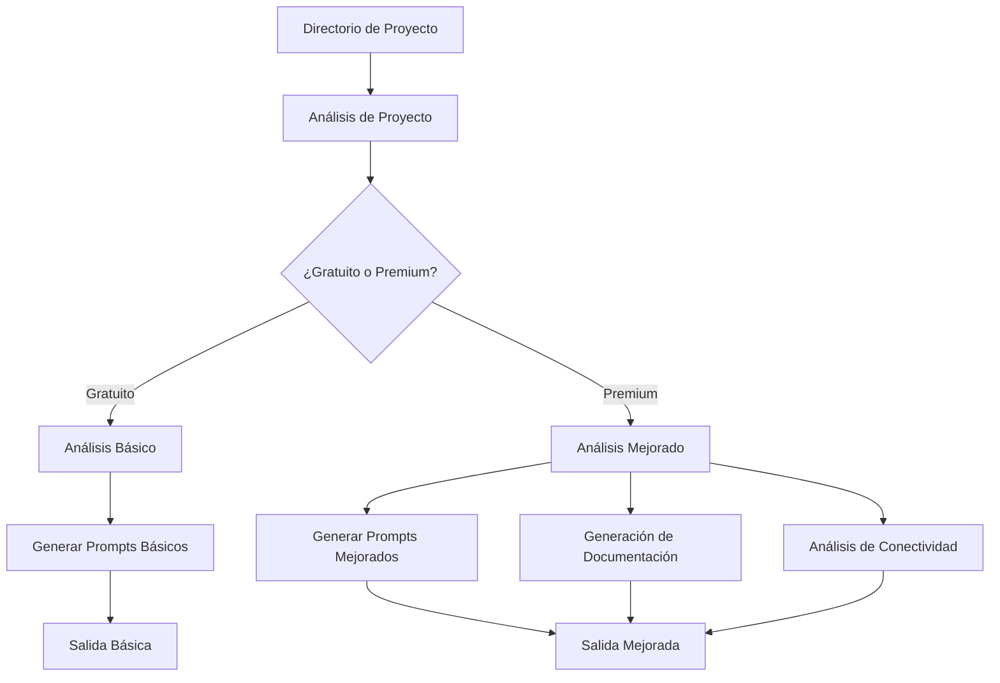

# Documentación de ProjectPrompt

## Visión General

ProjectPrompt es un asistente inteligente para analizar proyectos y generar prompts contextuales para modelos de IA. Ayuda a los desarrolladores a comprender la estructura del proyecto, detectar funcionalidades y crear prompts optimizados para varios asistentes de IA.

### Diagrama de Flujo de Trabajo



El diagrama de flujo muestra cómo ProjectPrompt procesa un directorio de proyecto a través del análisis y genera diferentes salidas dependiendo de si se están utilizando características gratuitas o premium.

> **Nota**: Esta es una traducción parcial de la documentación. Para la documentación completa en inglés, consulte [complete_documentation.md](complete_documentation.md).

## Tabla de Contenidos

1. [Instalación](#instalación)
2. [Funciones Principales](#funciones-principales)
3. [Características Avanzadas](#características-avanzadas)
4. [Referencia de Comandos](#referencia-de-comandos)
5. [Referencia de Scripts](#referencia-de-scripts)
6. [Pruebas](#pruebas)
7. [Desarrollo](#desarrollo)

## Instalación

### Instalación Rápida desde el Repositorio

```bash
# Descargar el repositorio
git clone https://github.com/projectprompt/project-prompt.git
cd project-prompt

# Crear enlaces simbólicos a los scripts
mkdir -p $HOME/bin
ln -sf $(pwd)/project_prompt.py $HOME/bin/project-prompt
chmod +x $HOME/bin/project-prompt

# Asegurar que $HOME/bin está en PATH
echo 'export PATH="$HOME/bin:$PATH"' >> ~/.zshrc
source ~/.zshrc
```

### Instalación por Paquete (Próximamente)

```bash
# Con pip
pip install project-prompt

# Con Poetry
poetry add project-prompt
```

Para la documentación completa en español, consulte con el equipo de desarrollo o utilice un traductor automático con la documentación en inglés.
